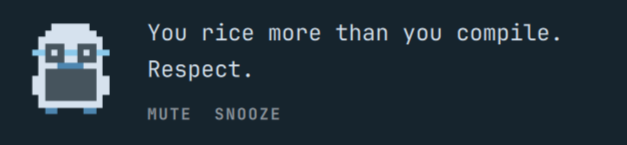
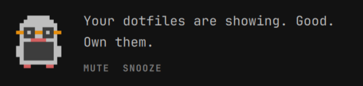
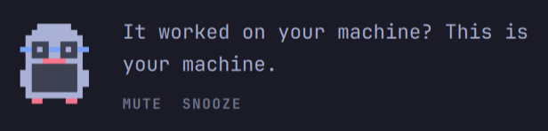
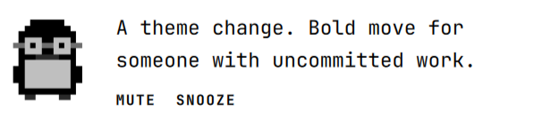

# Kernel Spirit

A grouchy kernel-hacker penguin that lives in the Omarchy bar and comments, in character, on what the machine is doing.

Left-click summons a line. He also wanders in on his own, and will pipe up when load stays high, the battery is leaving, you plug back in after a scare, the session runs late, uptime crosses a milestone, you wake the machine from suspend, you switch themes, or the calendar hits a Linux anniversary — he redraws himself in the new colors and has opinions about it. He blinks, glances around, his beak moves while he talks, and he hops when a line lands. Mute him from the bar without removing the plugin.

This is unofficial fan work. Not affiliated with or endorsed by Linus Torvalds, the Linux Foundation, or Omarchy. The character is a penguin spirit, not a likeness of a person. No photographs.

## Showcase

<p align="center">
  
  
  <br>
  
  
</p>

## Install

```sh
omarchy plugin add https://github.com/BVisagie/omarchy-kernel-spirit.git --enable
```

The penguin lands on the right of the bar. Move it with:

```sh
omarchy bar move io.github.bvisagie.kernel-spirit --section right
```

## Usage

| Action | What happens |
| --- | --- |
| Left-click | Summon a line now, or dismiss the bubble |
| Right-click | Mute / unmute wander and reactions (persists across shell restart) |
| Middle-click | Snooze for an hour (in-memory), or wake if already snoozed |
| Escape / click outside | Dismiss the bubble |
| MUTE / SNOOZE in the bubble | Same as right-click / middle-click |

Muted and snoozed, he still answers a left-click. He just stops interrupting.

## Configure

Settings live on the bar entry and apply live:

```sh
omarchy bar set io.github.bvisagie.kernel-spirit muted true
omarchy bar set io.github.bvisagie.kernel-spirit wanderIntervalMin 90
omarchy bar set io.github.bvisagie.kernel-spirit cooldownMin 45
omarchy bar set io.github.bvisagie.kernel-spirit loadTrigger false
```

| Key | Default | Meaning |
| --- | --- | --- |
| `muted` | `false` | Stop wander and reactions |
| `wanderIntervalMin` | `60` | Minutes between unsolicited general lines (jittered) |
| `cooldownMin` | `45` | Minutes between reactions |
| `autoHideMs` | `8000` | Speech bubble lifetime |
| `snoozeMin` | `60` | Middle-click snooze length |
| `loadTrigger` | `true` | Comment when load per core stays high |
| `batteryTrigger` | `true` | Comment when discharging at or below the threshold, and when power is restored |
| `lateNightTrigger` | `true` | Comment once per late-night session |
| `uptimeTrigger` | `true` | Comment at 1 / 7 / 14 / 30 / 60 / 90 / 100 day uptime |
| `themeTrigger` | `true` | Comment when the theme changes |
| `resumeTrigger` | `true` | Comment after resume from suspend |
| `specialDayTrigger` | `true` | Comment on Aug 25, Oct 5, and Friday after 16:00 |
| `loadThreshold` | `0.75` | Load per core that counts as busy |
| `batteryThreshold` | `20` | Battery percent that counts as low |
| `lateNightStartHour` | `0` | Late-night window start (0–23) |
| `lateNightEndHour` | `5` | Late-night window end (0–23) |

Signals are local: `/proc/loadavg`, `/proc/uptime`, UPower, the wall clock, and in-process shell theme colors. No network, no extra processes after a one-shot `nproc`.

## Remove

```sh
omarchy plugin remove io.github.bvisagie.kernel-spirit
```

Disable without removing:

```sh
omarchy plugin disable io.github.bvisagie.kernel-spirit
```

## Quoted lines

Most lines are original to the penguin and are never attributed to a person.

A few public quotes may appear, marked as quotations in the bubble:

- “Talk is cheap. Show me the code.” — Linus Torvalds, linux-kernel mailing list, 25 August 2000
- “Only wimps use tape backup: real men just upload their important stuff on ftp, and let the rest of the world mirror it ;)” — Linus Torvalds, linux-kernel mailing list, 20 July 1996
- “Given enough eyeballs, all bugs are shallow.” — “Linus's Law”, coined by Eric S. Raymond in *The Cathedral and the Bazaar*
